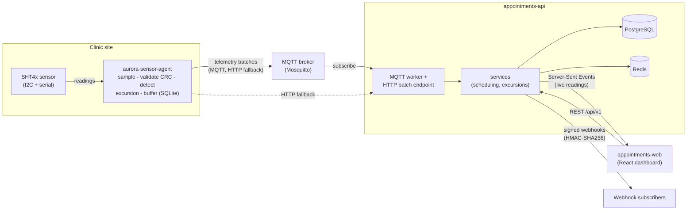

# Aurora Clinic

[](https://github.com/evg-g/appointments-api/actions/workflows/ci.yml)
[](https://github.com/evg-g/appointments-web/actions/workflows/ci.yml)
[](https://github.com/evg-g/aurora-sensor-agent/actions/workflows/ci.yml)
[](./LICENSE)

A clinic booking system with live monitoring of medication fridges, built as **three repos**: a
FastAPI backend, a React web app, and a Python IoT sensor agent. It shows **test automation and
CI/CD** at a professional level. Every test tier below runs in CI and fails the build when it breaks.

**Try it in the browser:** [live demo](https://evg-g.github.io/appointments-web/) (sign in as `admin@aurora.test` / `password123`;
no real backend, the app runs on its mock API — the local stack seeds `admin@aurora-clinic.com` instead) · [latest Playwright test report](https://evg-g.github.io/appointments-web/report/)

**Two-minute tour:** the [test tiers table](#test-automation-at-a-glance) → the
[bugs the gates caught](#bugs-the-gates-caught) → one deep dive:
[API testing](https://github.com/evg-g/appointments-api/blob/main/docs/TESTING.md),
[browser testing](https://github.com/evg-g/appointments-web/blob/main/docs/BROWSER_TESTING.md), or
[hardware-free device testing](https://github.com/evg-g/aurora-sensor-agent/blob/main/docs/HARDWARE_TESTING.md).

**One-page summary:** [portfolio PDF](docs/portfolio/Evgeni_Gavrilov_Aurora_Portfolio.pdf)

## My role

I'm a senior QA engineer with over 10 years in QA (since 2015). Since 2023 I have focused on
**test automation**, and I use AI every day to write, maintain, and run automated tests. Aurora
shows how I do this on a full system: an API, a web app, and an IoT device agent. Every level of
testing runs in CI, and a change can't merge until it passes.

Claude Code wrote most of the code and tests. I decided what to build and what to test, and I
checked every result myself. Some examples:

- I ran the accessibility tests myself in headed and debug mode, to see what a real user would see.
  I also tried to test the API by hand the way a visitor would. That is why the Swagger page now has
  an "Authorize" button and a short guide.
- The first version of the app looked empty, so I asked for a real cold-chain card, more demo data,
  and names in the audit log. The extra data showed a bug that the visual tests had missed.
- Before the release I asked for a full re-check. It found three problems: our release automation
  had broken the API contract check, two container images had new CVEs, and a local build could copy
  a private signing key into the device image. All three are fixed, and each one now has a test or a
  scan that would catch it again.
- I also built a QA toolkit that I can reuse on other projects. It writes Playwright tests from a
  user story, and it has a tester agent and a separate reviewer agent that can only read:
  [qa-ai-toolkit](https://github.com/evg-g/qa-ai-toolkit).

AI is fast at writing code, but it doesn't know what "done" means for the people who use the
product. That part is still my job.

## Test automation at a glance

| Layer | Tools | Where | Gate in CI |
|---|---|---|---|
| Unit | pytest, Vitest + Testing Library | all three repos | ✅ |
| Integration, real Postgres + Redis | pytest + testcontainers | [api `tests/integration`](https://github.com/evg-g/appointments-api/tree/main/tests/integration) | ✅ |
| Contract (OpenAPI + telemetry schema) | drift tests, `oasdiff` breaking-change check | [api `tests/contract`](https://github.com/evg-g/appointments-api/tree/main/tests/contract) | ✅ |
| Property-based / API fuzzing | Hypothesis, Schemathesis | [api `tests/property`](https://github.com/evg-g/appointments-api/tree/main/tests/property) | ✅ |
| Mutation testing | mutmut, kill rate ≥ 78% | [api `docs/TESTING.md`](https://github.com/evg-g/appointments-api/blob/main/docs/TESTING.md) | ✅ nightly |
| Security | authz matrix, JWT, injection tests; Trivy (code + images), gitleaks, pip/npm audit, CodeQL | [api `tests/security`](https://github.com/evg-g/appointments-api/tree/main/tests/security) · [device `security` job](https://github.com/evg-g/aurora-sensor-agent/blob/main/docs/CI_CD.md) | ✅ |
| End-to-end | Playwright, Chromium + WebKit, network mocked with MSW; story tests generated from user stories | [web `e2e/journeys`](https://github.com/evg-g/appointments-web/tree/main/e2e/journeys) · [`e2e/stories`](https://github.com/evg-g/appointments-web/tree/main/e2e/stories) | ✅ |
| Accessibility (WCAG 2.2 AA) | axe, every route, light + dark | [web `e2e/a11y`](https://github.com/evg-g/appointments-web/tree/main/e2e/a11y) | ✅ |
| Visual regression + layout rules | Playwright screenshots, layout assertions | [web `e2e/visual`](https://github.com/evg-g/appointments-web/tree/main/e2e/visual) | ✅ |
| Performance | Lighthouse (LCP/CLS/TBT), bundle-size budget | [web `docs/BROWSER_TESTING.md`](https://github.com/evg-g/appointments-web/blob/main/docs/BROWSER_TESTING.md) | ✅ |
| Load | Locust, p95 latency gate | [api `tests/load`](https://github.com/evg-g/appointments-api/tree/main/tests/load) | ✅ nightly |
| Device without hardware | simulator, trace replay, fault injection, 7-day soak on a fake clock | [device `docs/HARDWARE_TESTING.md`](https://github.com/evg-g/aurora-sensor-agent/blob/main/docs/HARDWARE_TESTING.md) | ✅ |

Current numbers: API 388 tests, 91% coverage, 79% mutation kill rate · web 83 unit/component
tests, 48 browser tests on Chromium and 38 on WebKit · device 241 tests (plus 2 software-in-the-loop
and 2 hardware-in-the-loop, which need Docker and a real sensor).

## Bugs the gates caught

Real failures, each fixed with a test or gate that now stops it from coming back:

| What broke | Caught by | Fix |
|---|---|---|
| 43 HIGH/CRITICAL CVEs: Starlette (3) and the nginx base image (40) | Trivy in CI | [api](https://github.com/evg-g/appointments-api/commit/25d1c77) · [web](https://github.com/evg-g/appointments-web/commit/cd1b6db) |
| New telemetry code lowered test strength: mutation kill rate 77.97% (< 78%) | nightly mutation gate | [tests that pin the excursion rules → 79.19%](https://github.com/evg-g/appointments-api/commit/a23249d) |
| Header labels wrapped onto two lines at 1280px, and the visual baselines had recorded it as correct | a new layout test (failed at 1024/1280/1440px) | [layout fix + test](https://github.com/evg-g/appointments-web/commit/41299b2) |
| Dashboard listed the latest booking first, not the soonest | review of the demo screenshots | [fix + unit tests](https://github.com/evg-g/appointments-web/commit/87850cc) |
| With more than five future bookings, the dashboard showed the furthest-out ones (it fetched the 5 newest, then sorted) | a richer demo dataset + screenshot review; the visual test missed it (under its 2% diff limit) | [fix + a test that fails on the old code](https://github.com/evg-g/appointments-web/commit/dbda243) |
| Our own release automation broke the API contract gate: release-please bumped the version, but the committed OpenAPI file kept the old one, so `main` went red | the contract drift test + coverage gate in CI (found while verifying the whole project) | [gate ignores only the version, 2 tests prove it](https://github.com/evg-g/appointments-api/commit/bdb9f75) |
| A local build could copy the device's private OTA signing key into the container image (no `.dockerignore`, and `COPY . .`) | a Trivy image scan during a full re-check (the device repo had no image scan) | [`.dockerignore`](https://github.com/evg-g/aurora-sensor-agent/commit/d4b6de0) + [a CI job that builds with a decoy key and fails if it reaches the image](https://github.com/evg-g/aurora-sensor-agent/commit/d901a24) |
| 4 HIGH CVEs in the device's `cryptography` 44.0.3 (used to verify OTA signatures), never reported because nothing audited the device's dependencies | the same re-check | [upgrade to 50.0.2](https://github.com/evg-g/aurora-sensor-agent/commit/d4b6de0) + [pip-audit and image scan in device CI](https://github.com/evg-g/aurora-sensor-agent/commit/d901a24) |
| 7 new HIGH OS CVEs (pcre2, openssl) in the API image, published after the last green build | Trivy image scan in CI | [upgrade OS packages at build time](https://github.com/evg-g/appointments-api/commit/0cccd43) |
| Component tests failed only when the machine was busy | reproduced by saturating every CPU core | [timeouts fixed; 4/4 green under load](https://github.com/evg-g/appointments-web/commit/1c63e53) |
| The secret scan failed on every pull request (missing token permission) | CI on Dependabot PRs | [api](https://github.com/evg-g/appointments-api/commit/f71293a) · [web](https://github.com/evg-g/appointments-web/commit/e065eee) |
| Audit-log text failed WCAG AA contrast (4.08:1) | axe accessibility sweep | [ADR 0006](https://github.com/evg-g/appointments-web/blob/main/docs/adr/0006-browser-test-tiers.md) |

Plus four deliberate "break it" checks (each break applied, the failing gate recorded, then reverted)
in [`docs/GATES_VERIFIED.md`](docs/GATES_VERIFIED.md), including an honest finding: the concurrent
double-booking integration test does not actually depend on the database constraint.

## How it is built

**Three independent products**, each its own git repo with its own pipeline, coupled only at their
contracts (an OpenAPI schema and a telemetry schema), so each can be built, tested, and deployed on
its own. The design decisions are written up as ADRs in each repo.

> Built with [Claude Code](https://claude.com/claude-code) as the working environment. The spec it
> started from and the build log are public in [`docs/process/`](docs/process/).

## What it looks like


| Dashboard | Appointments |
|---|---|
|  |  |
| **Booking: pick a time** | **Admin: audit log** |
|  |  |

<sub>Real rendered pages from the production build with its mock backend and a demo dataset,
captured by Playwright (`npm run screenshots` in appointments-web). Dark theme:
[cold chain (dark)](docs/screenshots/cold-chain-dark.png).</sub>

## The three repos

| Repo | What it is | Stack |
|---|---|---|
| [`appointments-api`](https://github.com/evg-g/appointments-api) | The backend: scheduling + telemetry ingestion | Python 3.12, FastAPI, PostgreSQL, Redis |
| [`appointments-web`](https://github.com/evg-g/appointments-web) | The web app: booking, admin, cold-chain dashboard | React 19, TypeScript, Vite |
| [`aurora-sensor-agent`](https://github.com/evg-g/aurora-sensor-agent) | The device agent on a fridge sensor node | Python 3.12, MQTT, SQLite buffer |

Start with each repo's `README.md` and `CLAUDE.md`. Build history lives in [`docs/process/PLAN.md`](./docs/process/PLAN.md).

## Break it on purpose

The fastest way to trust a safety net is to cut a hole in it and watch the alarm. Each repo has a
`docs/EXERCISES.md` with break-it-on-purpose exercises (26 in total): make the change, predict which
gate fails, run it, confirm:

- [`appointments-api/docs/EXERCISES.md`](https://github.com/evg-g/appointments-api/blob/main/docs/EXERCISES.md)
- [`appointments-web/docs/EXERCISES.md`](https://github.com/evg-g/appointments-web/blob/main/docs/EXERCISES.md)
- [`aurora-sensor-agent/docs/EXERCISES.md`](https://github.com/evg-g/aurora-sensor-agent/blob/main/docs/EXERCISES.md)

Four of them were run for real and the failing gates recorded in
[`docs/GATES_VERIFIED.md`](./docs/GATES_VERIFIED.md).

## More detail

Reference material, collapsed so the page stays short. Click a heading to open it.

<details>
<summary><b>What is in it</b></summary>

Feature-complete, released from `main` by release-please: [api v1.0.1](https://github.com/evg-g/appointments-api/releases/tag/v1.0.1) · [web v1.1.0](https://github.com/evg-g/appointments-web/releases/tag/v1.1.0). The device agent ships as a `.deb` package and a signed OTA manifest rather than a tagged release. Highlights:

- **Backend:** full `/api/v1` surface with auth (JWT + refresh rotation), RBAC, RFC 9457 errors,
  cursor pagination, idempotency, ETag/If-Match, rate limiting, signed webhooks, and telemetry
  ingestion (MQTT + HTTP, idempotent and order-independent) with a server-side excursion engine and an
  SSE stream. Unit / integration (testcontainers) / contract / property / security / load tiers, with
  enforced coverage and mutation gates.
- **Web:** design-token UI (light/dark), a client generated from the OpenAPI schema, the booking flow,
  admin, audit log, and a live cold-chain dashboard. Vitest + MSW, Playwright E2E (MSW and the fully
  composed real stack), axe a11y, visual regression, and Lighthouse/bundle budgets.
- **Device:** the SHT4x driver with CRC, real/sim/replay hardware seams behind Protocols, the
  excursion state machine, a store-and-forward buffer, the full fault catalogue, a compressed seven-day
  soak, software-in-the-loop against a real broker + the API, a fleet simulator, and a signed OTA rollout.
- **CI/CD:** the API and the web app build, scan (Trivy/gitleaks/CodeQL/SBOM), sign (cosign), and
  deploy (Azure Container Apps via OIDC), with every cloud step gated so a fork stays green with zero
  secrets. The device agent builds a `.deb` and a signed OTA manifest, and its CI audits dependencies,
  scans for secrets, and scans its container image.

</details>

<details>
<summary><b>How they fit together</b></summary>



More diagrams (the appointment and excursion state machines, the auth flow, the telemetry data path,
the CI/CD pipeline, and the contract flow) are collected in
[`appointments-api/docs/DIAGRAMS.md`](https://github.com/evg-g/appointments-api/blob/main/docs/DIAGRAMS.md).

</details>

<details>
<summary><b>Contracts (how the repos stay in sync)</b></summary>

- `appointments-api` publishes `contracts/openapi.json`. A CI job (`oasdiff`) fails a PR on a
  breaking change unless it is labelled and the version is bumped.
- `appointments-web` vendors that schema and **generates** its API client from it; CI fails on
  drift, so a backend change that affects the front end breaks loudly.
- `aurora-sensor-agent` owns the telemetry contract (`contracts/telemetry.schema.json` +
  AsyncAPI). The API vendors it and validates every inbound message; its CI fails on drift.

See [`appointments-api/docs/CONTRACT_WORKFLOW.md`](https://github.com/evg-g/appointments-api/blob/main/docs/CONTRACT_WORKFLOW.md).

</details>

<details>
<summary><b>Deep dives by topic</b></summary>

| Area | Where | What it covers |
|---|---|---|
| REST API design | [`appointments-api`](https://github.com/evg-g/appointments-api) | resource modelling, RFC 9457 errors, cursor pagination, idempotency, ETag/If-Match |
| API testing pyramid | [`appointments-api/docs/TESTING.md`](https://github.com/evg-g/appointments-api/blob/main/docs/TESTING.md) | unit vs integration vs contract vs property vs security; fakes vs mocks vs stubs vs spies; why coverage is a weak signal |
| Testing by topic | [`appointments-api/docs/API_TESTING_GUIDE.md`](https://github.com/evg-g/appointments-api/blob/main/docs/API_TESTING_GUIDE.md) + [`requests/*.http`](https://github.com/evg-g/appointments-api/tree/main/requests) | how to test auth, pagination, idempotency, concurrency, DST, webhooks, errors, with hand-runnable requests |
| Try the API by hand | [`appointments-api/README.md` → *Try the API by hand*](https://github.com/evg-g/appointments-api#try-the-api-by-hand) | Swagger UI (`/docs`), ReDoc, `.http` files in VS Code, and importing the OpenAPI spec into Postman |
| Concurrency in the DB | [`appointments-api`](https://github.com/evg-g/appointments-api) | why the no-double-booking rule lives in a Postgres exclusion constraint, not the app |
| Time & DST | [`appointments-api`](https://github.com/evg-g/appointments-api) | booking in a clinic's timezone with an injected clock |
| CI/CD | [`api`](https://github.com/evg-g/appointments-api/blob/main/docs/CI_CD.md) · [`web`](https://github.com/evg-g/appointments-web/blob/main/docs/CI_CD.md) · [`device`](https://github.com/evg-g/aurora-sensor-agent/blob/main/docs/CI_CD.md) | quality gates, containerization, scanning, signing, OIDC deploys that skip cleanly without secrets |
| Contract-driven repos | [`appointments-api/docs/CONTRACT_WORKFLOW.md`](https://github.com/evg-g/appointments-api/blob/main/docs/CONTRACT_WORKFLOW.md) | OpenAPI + telemetry schemas as the seam; drift and breaking-change gates in both directions |
| Professional UI | [`appointments-web`](https://github.com/evg-g/appointments-web) | design tokens, four async states, WCAG 2.2 AA, performance budgets |
| Frontend testing | [`appointments-web/docs/BROWSER_TESTING.md`](https://github.com/evg-g/appointments-web/blob/main/docs/BROWSER_TESTING.md) | MSW at the network layer, Playwright E2E, axe, visual regression, Lighthouse |
| Hardware without hardware | [`aurora-sensor-agent/docs/HARDWARE_TESTING.md`](https://github.com/evg-g/aurora-sensor-agent/blob/main/docs/HARDWARE_TESTING.md) | Protocol seams, register-level + CRC tests, sim/replay, fault injection, soak with a fake clock |
| Device delivery | [`PACKAGING.md`](https://github.com/evg-g/aurora-sensor-agent/blob/main/docs/PACKAGING.md) · [`OTA_ROLLOUT.md`](https://github.com/evg-g/aurora-sensor-agent/blob/main/docs/OTA_ROLLOUT.md) | .deb packaging, a signed OTA manifest, and a staged rollout with auto-halt |

</details>

<details>
<summary><b>Running it</b></summary>

Each repo bootstraps with one command from a clean shell:

```bash
# WSL (Ubuntu-24.04): clone the three repos side by side
git clone https://github.com/evg-g/appointments-api.git
git clone https://github.com/evg-g/appointments-web.git
git clone https://github.com/evg-g/aurora-sensor-agent.git

cd appointments-api      && make setup && make dev        # backend on :8000
cd appointments-web      && make setup && make dev        # web on :5173
cd aurora-sensor-agent   && make setup && make ci-local   # device: lint + types + contract + tests
```

Full stacks:

```bash
# appointments-api: Postgres + Redis + API + migrations
make stack-up && make seed

# appointments-web: the composed real stack (API + Postgres + Redis behind nginx), then E2E
make e2e-composed-all

# aurora-sensor-agent: the whole agent against the simulated sensor, or a virtual fleet
make run
make fleet
```

Behind a TLS-inspecting corporate proxy, see each repo's `docs/CORPORATE_NETWORK.md` /
`docs/BROWSER_TESTING.md`. On a clean network none of that is needed.

Restoring the whole project on a new or formatted machine (toolchain, auth, clone layout, proxy and
test-tier setup): [`docs/process/RECOVERY.md`](./docs/process/RECOVERY.md).

</details>

## License

MIT, see [`LICENSE`](./LICENSE); each code repo carries its own copy.
