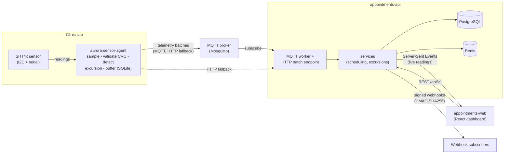

# Aurora Clinic

A reference-grade learning system: **multi-clinic appointment scheduling** with **medication
cold-chain monitoring**. It exists to be read and extended as a way to learn REST API design,
automated testing at every layer, CI/CD, a professional UI, and Python on the device side.

This is not one app. It is **three independent products**, each its own git repo with its own
pipeline. They are deliberately coupled only at their contracts (an OpenAPI schema and a
telemetry schema), so each can be built, tested, and deployed on its own.

## The three repos

| Repo | What it is | Stack |
|---|---|---|
| [`appointments-api`](./appointments-api) | The backend: scheduling + telemetry ingestion | Python 3.12, FastAPI, PostgreSQL, Redis |
| [`appointments-web`](./appointments-web) | The web app: booking, admin, cold-chain dashboard | React 19, TypeScript, Vite |
| [`aurora-sensor-agent`](./aurora-sensor-agent) | The device agent on a fridge sensor node | Python 3.12, MQTT, SQLite buffer |

Start with each repo's `README.md` and `CLAUDE.md`. Build progress lives in [`PLAN.md`](./PLAN.md).

## How they fit together



## Contracts (how the repos stay in sync)

- `appointments-api` publishes `contracts/openapi.json`. A CI job (`oasdiff`) fails a PR on a
  breaking change unless it is labelled and the version is bumped.
- `appointments-web` vendors that schema and **generates** its API client from it; CI fails on
  drift, so a backend change that affects the front end breaks loudly.
- `aurora-sensor-agent` owns the telemetry contract (`contracts/telemetry.schema.json` +
  AsyncAPI). The API vendors it and validates every inbound message; its CI fails on drift.

See `docs/CONTRACT_WORKFLOW.md` in the API repo (added in milestone 7) for the full flow.

## Running it

Each repo bootstraps with one command from a clean shell:

```bash
# WSL (Ubuntu-24.04)
cd appointments-api && make setup && make dev        # backend on :8000
cd appointments-web && make setup && make dev        # web on :5173
cd aurora-sensor-agent && make setup && make test    # device agent tests
```

A full-stack `docker-compose.yml` and a fleet simulator arrive in later milestones.

## License

MIT — each repo carries its own `LICENSE`.
