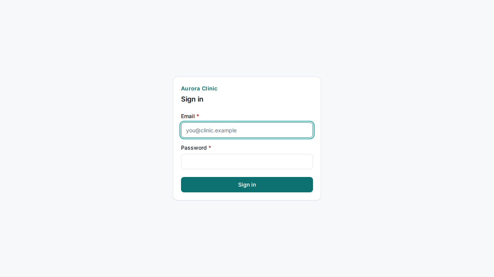
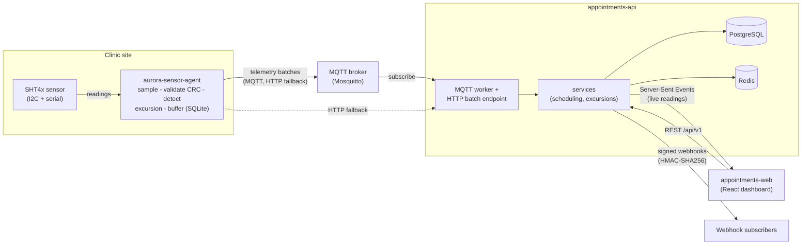

# Aurora Clinic

A reference-grade learning system: **multi-clinic appointment scheduling** with **medication
cold-chain monitoring**. It exists to be read and extended as a way to learn REST API design,
automated testing at every layer, CI/CD, a professional UI, and Python on the device side.

This is not one app. It is **three independent products**, each its own git repo with its own
pipeline. They are deliberately coupled only at their contracts (an OpenAPI schema and a
telemetry schema), so each can be built, tested, and deployed on its own.

> Built end to end with [Claude Code](https://claude.com/claude-code) as the working environment. The
> decisions — recorded as ADRs in each repo — are as much the point of the project as the code.

## What it looks like

| Booking dashboard | Booking flow |
|---|---|
|  |  |
| **Admin** | **Login** |
|  |  |

<sub>These are the committed Playwright visual-regression baselines (light theme) — the real rendered
pages, not mockups. A dark theme ships too.</sub>

## The three repos

| Repo | What it is | Stack |
|---|---|---|
| [`appointments-api`](./appointments-api) | The backend: scheduling + telemetry ingestion | Python 3.12, FastAPI, PostgreSQL, Redis |
| [`appointments-web`](./appointments-web) | The web app: booking, admin, cold-chain dashboard | React 19, TypeScript, Vite |
| [`aurora-sensor-agent`](./aurora-sensor-agent) | The device agent on a fridge sensor node | Python 3.12, MQTT, SQLite buffer |

Start with each repo's `README.md` and `CLAUDE.md`. Build history lives in [`PLAN.md`](./PLAN.md).

## Status

**Complete** — all 16 milestones built, tested, and committed. Highlights:

- **Backend** — full `/api/v1` surface with auth (JWT + refresh rotation), RBAC, RFC 9457 errors,
  cursor pagination, idempotency, ETag/If-Match, rate limiting, signed webhooks, and telemetry
  ingestion (MQTT + HTTP, idempotent and order-independent) with a server-side excursion engine and an
  SSE stream. Unit / integration (testcontainers) / contract / property / security / load tiers, with
  enforced coverage and mutation gates.
- **Web** — design-token UI (light/dark), a client generated from the OpenAPI schema, the booking flow,
  admin, audit log, and a live cold-chain dashboard. Vitest + MSW, Playwright E2E (MSW and the fully
  composed real stack), axe a11y, visual regression, and Lighthouse/bundle budgets.
- **Device** — the SHT4x driver with CRC, real/sim/replay hardware seams behind Protocols, the
  excursion state machine, a store-and-forward buffer, the full fault catalogue, a compressed seven-day
  soak, software-in-the-loop against a real broker + the API, a fleet simulator, and a signed OTA rollout.
- **CI/CD** — all three repos build, scan (Trivy/gitleaks/CodeQL/SBOM), sign (cosign), and deploy
  (Azure Container Apps via OIDC), with every cloud step gated so a fork stays green with zero secrets.

## How they fit together



More diagrams — the appointment and excursion state machines, the auth flow, the telemetry data path,
the CI/CD pipeline, and the contract flow — are collected in
[`appointments-api/docs/DIAGRAMS.md`](./appointments-api/docs/DIAGRAMS.md).

## Contracts (how the repos stay in sync)

- `appointments-api` publishes `contracts/openapi.json`. A CI job (`oasdiff`) fails a PR on a
  breaking change unless it is labelled and the version is bumped.
- `appointments-web` vendors that schema and **generates** its API client from it; CI fails on
  drift, so a backend change that affects the front end breaks loudly.
- `aurora-sensor-agent` owns the telemetry contract (`contracts/telemetry.schema.json` +
  AsyncAPI). The API vendors it and validates every inbound message; its CI fails on drift.

See [`appointments-api/docs/CONTRACT_WORKFLOW.md`](./appointments-api/docs/CONTRACT_WORKFLOW.md).

## What each repo teaches

| Area | Where | What you learn |
|---|---|---|
| REST API design | `appointments-api` | resource modelling, RFC 9457 errors, cursor pagination, idempotency, ETag/If-Match |
| API testing pyramid | `appointments-api/docs/TESTING.md` | unit vs integration vs contract vs property vs security; fakes vs mocks vs stubs vs spies; why coverage is a weak signal |
| Testing by topic | `appointments-api/docs/API_TESTING_GUIDE.md` + `requests/*.http` | how to test auth, pagination, idempotency, concurrency, DST, webhooks, errors — with hand-runnable requests |
| Try the API by hand | `appointments-api/README.md` → *Try the API by hand* | Swagger UI (`/docs`), ReDoc, `.http` files in VS Code, and importing the OpenAPI spec into Postman |
| Concurrency in the DB | `appointments-api` | why the no-double-booking rule lives in a Postgres exclusion constraint, not the app |
| Time & DST | `appointments-api` | booking in a clinic's timezone with an injected clock |
| CI/CD | each repo's `docs/CI_CD.md` | quality gates, containerization, scanning, signing, OIDC deploys that skip cleanly without secrets |
| Contract-driven repos | `docs/CONTRACT_WORKFLOW.md` | OpenAPI + telemetry schemas as the seam; drift and breaking-change gates in both directions |
| Professional UI | `appointments-web` | design tokens, four async states, WCAG 2.2 AA, performance budgets |
| Frontend testing | `appointments-web/docs/BROWSER_TESTING.md` | MSW at the network layer, Playwright E2E, axe, visual regression, Lighthouse |
| Hardware without hardware | `aurora-sensor-agent/docs/HARDWARE_TESTING.md` | Protocol seams, register-level + CRC tests, sim/replay, fault injection, soak with a fake clock |
| Device delivery | `aurora-sensor-agent/docs/{PACKAGING,OTA_ROLLOUT}.md` | .deb packaging, a signed OTA manifest, and a staged rollout with auto-halt |

## Learn by breaking it

The fastest way to trust a safety net is to cut a hole in it and watch the alarm. Each repo has a
`docs/EXERCISES.md` with break-it-on-purpose exercises (26 in total) — make the change, predict which
gate fails, run it, confirm:

- [`appointments-api/docs/EXERCISES.md`](./appointments-api/docs/EXERCISES.md)
- [`appointments-web/docs/EXERCISES.md`](./appointments-web/docs/EXERCISES.md)
- [`aurora-sensor-agent/docs/EXERCISES.md`](./aurora-sensor-agent/docs/EXERCISES.md)

Four of them were run for real and the failing gates recorded in
[`docs/GATES_VERIFIED.md`](./docs/GATES_VERIFIED.md).

## Running it

Each repo bootstraps with one command from a clean shell:

```bash
# WSL (Ubuntu-24.04)
cd appointments-api      && make setup && make dev        # backend on :8000
cd appointments-web      && make setup && make dev        # web on :5173
cd aurora-sensor-agent   && make setup && make ci-local   # device: lint + types + contract + tests
```

Full stacks:

```bash
# appointments-api: Postgres + Redis + API + migrations
make stack-up && make seed

# appointments-web: the composed real stack (API + Postgres + Redis behind nginx), then E2E
make e2e-composed-all

# aurora-sensor-agent: the whole agent against the simulated sensor, or a virtual fleet
make run
make fleet
```

Behind a TLS-inspecting corporate proxy, see each repo's `docs/CORPORATE_NETWORK.md` /
`docs/BROWSER_TESTING.md`. On a clean network none of that is needed.

Restoring the whole project on a new or formatted machine (toolchain, auth, clone layout, proxy and
test-tier setup): [`RECOVERY.md`](./RECOVERY.md).

## License

MIT — each repo carries its own `LICENSE`.
